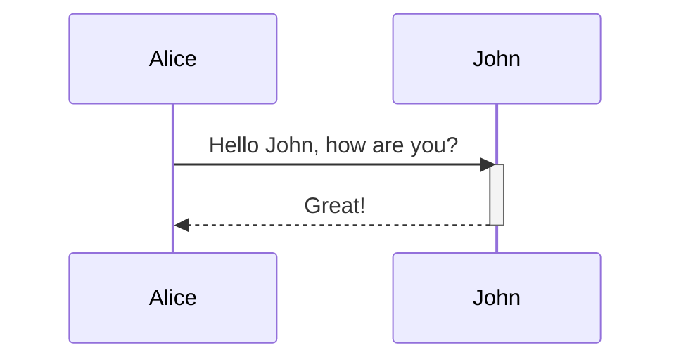
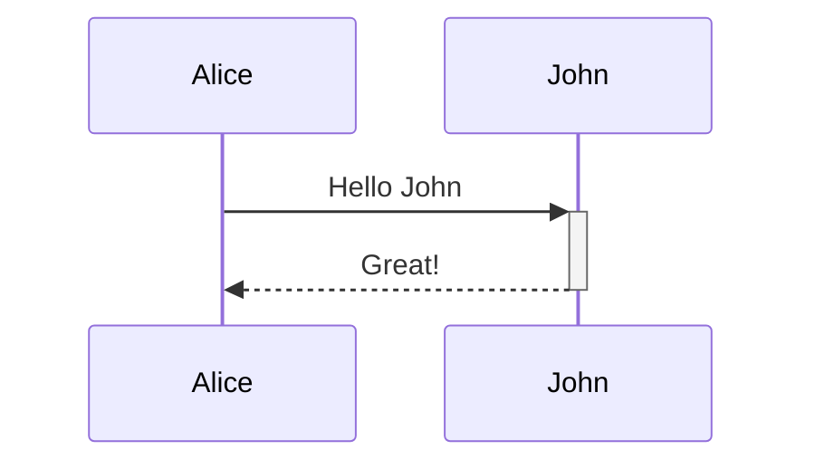

# Usage Guide

Learn how to use **Mermify** to visually and programmatically edit and export Mermaid flowcharts.

---

## 1. The Basic Workflow

Mermify provides a side-by-side hybrid editing interface:
- **Left Panel**: Monaco Code Editor where you can type Mermaid syntax directly.
- **Right Panel**: A fully interactive Live Preview canvas showing the rendered SVG.

---

## 2. Managing Nodes

### Add a Standalone Node
Click the floating **Add Node** button at the bottom-left corner of the preview canvas to create a new node:
1. Click **Add Node** button.
2. The Node Properties modal opens automatically.
3. Fill in the label and select a shape.

### Drag to Create Nodes
You can drag from the indicator socket on any node overlay to an empty space on the canvas to instantly create a new node connected to it:
1. Find the small circular drag socket on the right side of the node.
2. Drag it to any empty canvas area.
3. A connected node will be created, and its properties modal will open automatically.

---

## 3. Connecting Nodes

To connect two existing nodes:
1. Click and hold the circular drag socket on the source node.
2. Drag the connection line over the target node.
3. Release the mouse button to establish the connection.

---

## 4. Editing Nodes and Edges

### Edit Nodes
Click on any node overlay in the preview canvas to open the **Node Properties** modal. Here you can:
- Change the node label in real-time.
- Customize the node shape (choose from 11 available shapes).

### Edit Edges
Click on any link/arrow overlay to open the **Link Properties** modal:
- Change the edge label.
- Select the arrow/line style (solid arrow, dotted, bold, etc.).

### Deleting Nodes and Edges
- **Nodes**: Hover over a node, then click the red **Delete (Trash)** button in the top-right corner.
- **Edges**: Hover over a link, then click the red **Delete (Trash)** button.

---

## 5. Sharing Diagrams

Click the **Share Link** button in the preview header to copy a compressed URL to your clipboard. Sharing this link allows others to load your exact diagram state instantly.

---

## 6. Exporting Diagrams

Click the **Export** dropdown button in the preview header to access the export options:
- **Download PNG**: Save the diagram as a high-resolution PNG image.
- **Copy PNG to Clipboard**: Copy the PNG image directly to your clipboard to paste it anywhere (e.g. Slack, Google Docs).
- **Download SVG**: Save the vector graphic SVG file.

---

## 7. Sequence Diagrams

Mermify supports editing **Sequence Diagrams** interactively alongside standard flowcharts:

- **Participant Reordering**: Click and drag participant boxes at the top of the canvas to reorder them. The editor will automatically reorder the participant declarations in the Mermaid code.
- **Participant Properties**: Click any participant to open properties, or double-click to quickly rename it inline.
- **Message Editing**: Click any message connection line to customize its arrow style or delete it, or double-click to rename the message label inline.
- **Interactive Message Rerouting**: Drag the message connection socket handles to change the sender or receiver, or drag them up/down to reorder messages.
- **Autonumbering**: Use the **Autonumber** toggle button in the preview header to quickly show or hide message sequence numbers.

---

## 8. Limitations & Unsupported Features

While Mermify aims to support a wide range of Mermaid diagrams, certain advanced syntaxes will bypass or break the visual interactive editor layer:

### Sequence Diagram Activations
Explicit activation and deactivation declarations are currently **not supported** in the interactive visual editor. Using them will break the visual overlay synchronization.

Avoid declarations like:

Similarly, the shortcut +/- suffix notation on message arrows is also not supported:

> [!WARNING]
> If you write these unsupported elements in the code editor, they will render correctly in the SVG preview, but the visual interaction overlay (dragging, double-clicking, reordering) will be disabled or misaligned.

